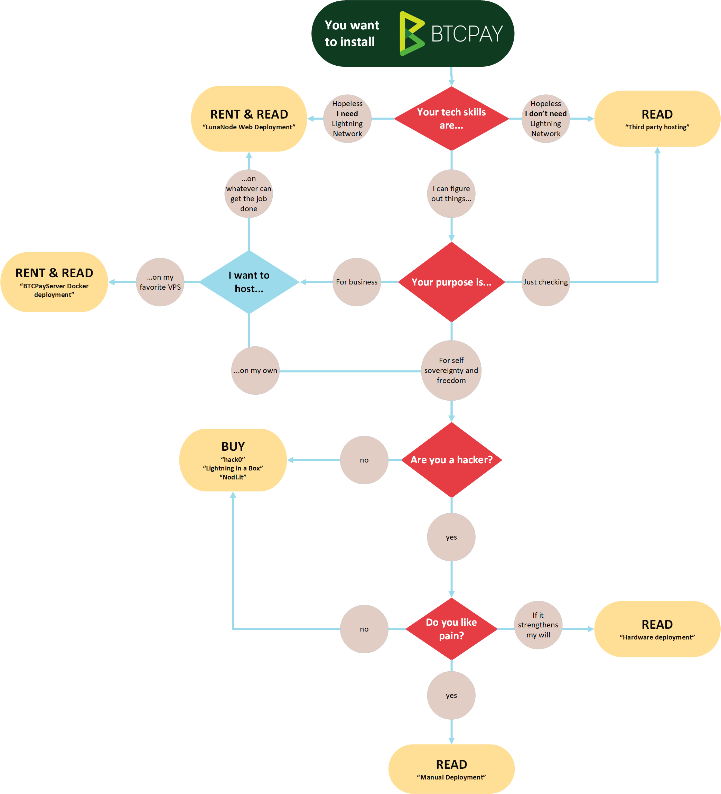

# Choosing a Deployment Method


There are multiple options for hosting your BTCPay Server solution depending on your level of technical knowledge, the needs you're looking to fulfill and the cost your willing to pay.


#### **For a quick idea, refer to this graphic created by BTCPay Server team:**

#### **Here are a list of possible deployment methods for your store:**

<table><thead><tr><th>Method</th><th data-type="rating" data-max="5">Difficulty</th><th>All features available?</th><th>Approx. Monthly Cost</th></tr></thead><tbody><tr><td>LunaNode</td><td>1</td><td>Yes</td><td>$10</td></tr><tr><td>Third-party host</td><td>1</td><td>Host: Yes Hostee: No</td><td>Free or Paid</td></tr><tr><td>Hardware &#x26; Cloud as a Service</td><td>2</td><td>Yes</td><td>Varies on provider</td></tr><tr><td>Virtual Private Network</td><td>3</td><td>Yes</td><td>$10-$70</td></tr><tr><td>Manual deployment</td><td>5</td><td>Yes</td><td>Components + Electricity</td></tr><tr><td>Hardware Build</td><td>5</td><td>Yes</td><td>Components + Electricity</td></tr></tbody></table>


This guide will cover LunaNode and Third-party hosting through Bull Bitcoin. You will be provided with the ressources in order to also use Hardware solutions. To learn more about the other options, go [here](https://docs.btcpayserver.org/Deployment/).


#### **LunaNode**

[LunaNode](https://www.lunanode.com) is Canadian-based hosting provider that accept Bitcoin payments and requires no personal identification except for a phone number verification.


This method is highly recommended if you don't have a lot of technical knowledge.


You will be able to use all of BTCPay Server's features, including the Lightning Network payment option by hosting a Bitcoin node through their service.&#x20;

#### **Third-Party Hosting with Bull Bitcoin**

Bull Bitcoin has a BTCPay server hosting solution which allows you to avoid deploying your own self-hosted BTCPay Server and managing it.

You still receive payments directly to your wallet and we never ask for your Bitcoin private key to do so.


BTCPay Server does not allow server hosts to view the stores of other users nor have access to any personal data (except for registration email address). The extended public key and even balances of other users can't be seen.



All payments made through the Lightning Network will go to your third-party's wallet. Take precautions and only use this option while using a trustworthy third-party host to ensure you get your funds back.


#### **Use your own Hardware**

You also have the option of building your own node using hardware that you purchase.&#x20;
